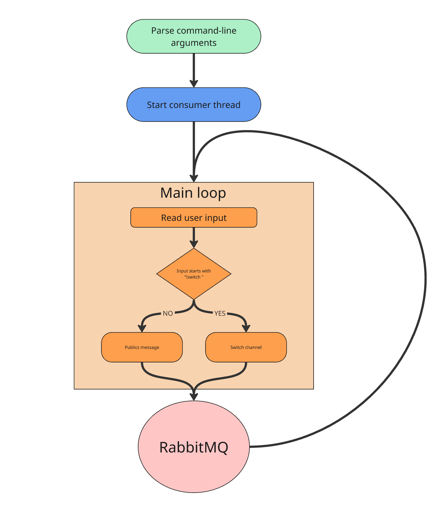

## Консольный сетевой чат на RabbitMQ

### Краткое описание:

Приложение представляет собой консольный клиент для обмена сообщениями через RabbitMQ. Каждый клиент подключается к "каналу" (реализованному как fanout exchange), получает только текущие сообщения, может переключаться между каналами с помощью команды !switch, автоматически создавая новые каналы по необходимости.

### Использованные зависимости:
* RabbitMQ (pika) - для реализации серверной части приложения. 

### Структура:
* chat_client.py — основной клиентский скрипт.
* Зависит от сервера RabbitMQ, расположенного по адресу localhost (по умолчанию).

### Usecase diagram:

### Компоненты:
* main loop - считывает пользовательский ввод и публикует сообщения или переключает канал.
* publish method - отправляет сообщение в заданный канал через RabbitMQ.
* start_consumer - подписывается на заданный канал и обрабатывает входящие сообщения в фоновом потоке.
* switch_channel - перезапускает потребителя с новым каналом.
* argparse - обрабатывает аргументы командной строки.
* RabbitMQ server - сервер, запущенный в докере, для обработки запросов. 

### Ограничения:
* Нет истории сообщений.
* Нет GUI.